# SafeCalc 
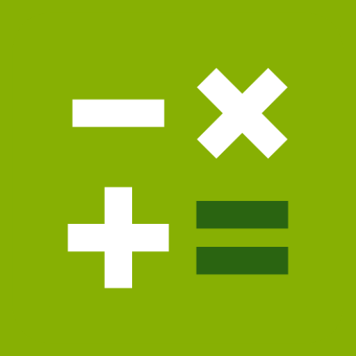

_A secured and elusive vault for your memos, passwords, notes, and more..._

****
## Intro
Hello fellow developers. The idea of an elusive app, an app that has a hidden purpose besides its facade, has always been quite attractive for every one of us, especially rookies like me and my collab. Although, with a shallow search, you can find a lot, and a lot of other apps with the same idea and purpose, with better execution and experience than we can realize. Such a thing wouldn't be enough to stop us newbies from playing and trying something on our own. That's because it's an opputunity to learn and practice more with the technology we used to build this prototype, which is android studio, alongside many other programming languages like java and kotlin. And also the ones android studio uses under the hood. 
There are many more things to say and talk about, but of course you didn't come here for a little onesided chitchat, so without further ado, let's start.

## Description

As I said previously, we are using android studio. which is the official IDE - developed by the JetBrains community, and freely provided by Google - for native android apps development.
This IDE comes with an __out-of-the-box__ support to the __MVC design pattern__. So there is a:
* view,
*  a model, 
*  and a controller.

Our __views__ and their respective __controllers__ are as follows:
* 📺 activity_add.xml
  * 🎮 AddActivity.kt  
* 📺 activity_choose_db.xml
  * 🎮 ChooseDBActivity.kt
* 📺 activity_main.xml
  * 🎮 MainActivity.kt
* 📺 activity_memo.xml
  * 🎮 MemoActivity.java
* 📺 acitivity_update.xml
  * 🎮 UpdateActivity.kt

Our __Data Access Object__ is:
* 💾 MyDatabaseHelper.java

A RecyclerView was used in the MemoActivity, so it has as an adapter the __CustomAdapter__.java class, and the __my_row__.xml as an item holder for the recycler view.

## Design

Neither of us—me nor my collaborator—is a design expert, so we decided to mimic Samsung's calculator app. At first, it might sound like we are being lazy, but there is a good reason behind this: we are trying to mimic Samsung's calculator in every detail so that the user will be able to fool any peeking eye and be sure that no one that has access to his phone will even doubt that the calculator sitting in front of them is hiding secrets㊙️. We intend to include image and video storage in future versions, as well as tighter security, so your secrets can even be considered classified🔐 files	📁.

****

## Table of contents
- [SafeCalc](#safecalc)
  - [Intro](#intro)
  - [Description](#description)
  - [Design](#design)
  - [Table of contents](#table-of-contents)
  - [The User Interface](#the-user-interface)
  - [Light Mode](#light-mode)
    - [Main Activity](#main-activity)
      - [the calculator: portrait](#the-calculator-portrait)
      - [the calculator: landscape](#the-calculator-landscape)
    - [Choose db Activity](#choose-db-activity)
      - [connect to the database ](#connect-to-the-database)
    - [Memo Activity](#memo-activity)
    - [Add Memo Activity](#add-memo-activity)
    - [Update Memo Activity](#update-memo-activity)
  - [Dark Mode](#dark-mode)
    - [Main Activity](#main-activity-1)
      - [the calculator: protrait](#the-calculator-protrait)
      - [the calculator: landscape](#the-calculator-landscape-1)
    - [Choose db Activity](#choose-db-activity-1)
    - [Memo Activity](#memo-activity-1)
    - [Add Memo Activity](#add-memo-activity-1)
    - [Update Memo Activity](#update-memo-activity-1)
  - [Material Components](#material-components)
    - [Edit Text](#edit-text)
    - [Drawables](#drawables)
    - [Color Palettes](#color-palettes)
      - [first palette](#first-palette)
      - [second palette](#second-palette)
  - [Tests](#tests)
  - [License](#license)
  - [Credits 2022](#credits-2022)

****

## The User Interface

There are five interfaces in total. The main interface, which is ActivityMain, has four states. The first state is __landscape mode__. The second is __portrait mode__. The third is the __dark mode__. And the fourth is the __light mode__. In each of these states, the main container and layout was the constraint layout. The calculator interface contains 24 buttons. Those buttons are not so many to handle using the constraint layout, so I decided to use it wherever I could, and that's what I did, and the interface looks great on almost all phones except tablets 😓. And of course, that wasn't my only reason to do so; there was also the seeking of originality that I wanted to implement because I saw most people choose the much simpler and easier approach and use the linear layout and table layout. Maybe there is a much more profound and meaningful reason behind such a choice that I'm oblivious to, but I don't care. I am a newbie, and I will do newbie things while I still can.

## Light Mode

### Main Activity 
#### the calculator: portrait
By the way, I forgot to mention that the calculator doesn't work yet. I implemented the logic, but it was buggy, so I got rid of it for the moment. It will be added later after a thorough correction.

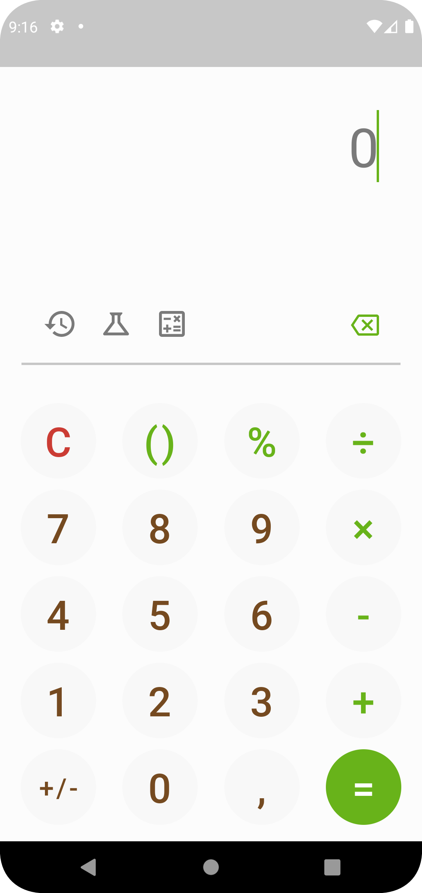

#### the calculator: landscape

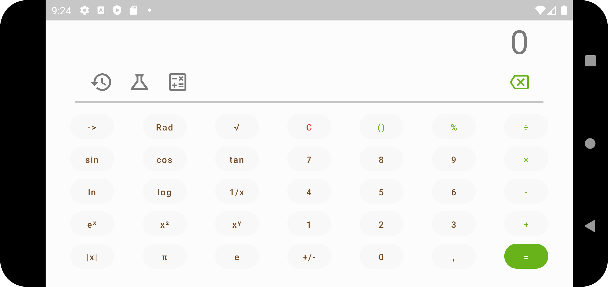

### Choose db Activity
In this activity, you get the chance to choose the database that you will connect to, so it plays the role of a login alongside the pin code of the calculator.

#### connect to the database 

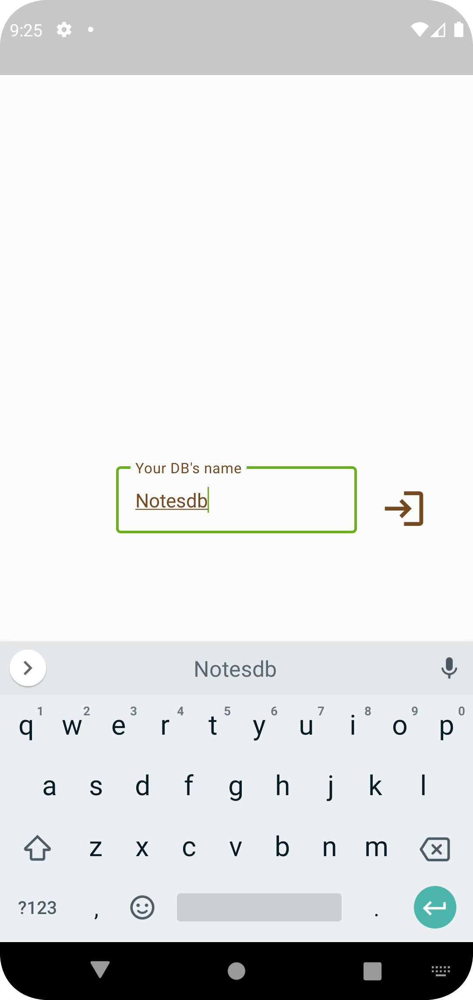

### Memo Activity

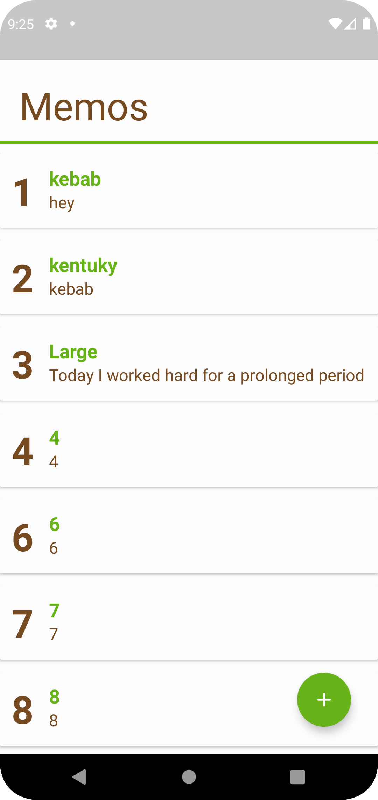

### Add Memo Activity

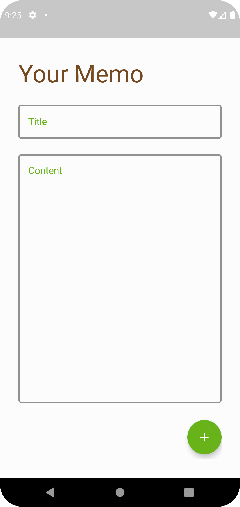

### Update Memo Activity

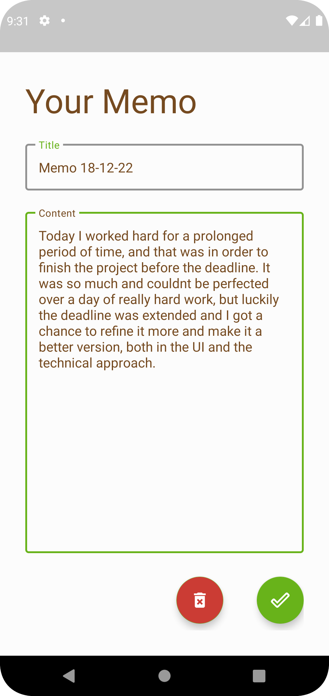

## Dark Mode

### Main Activity

#### the calculator: protrait

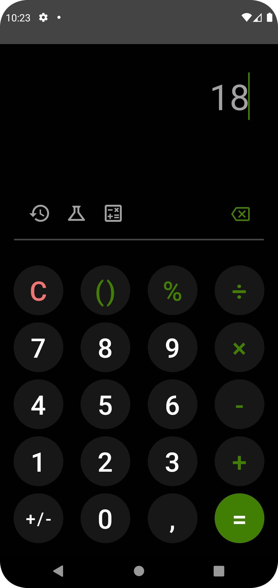

#### the calculator: landscape

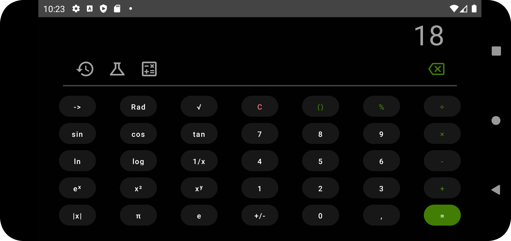

### Choose db Activity

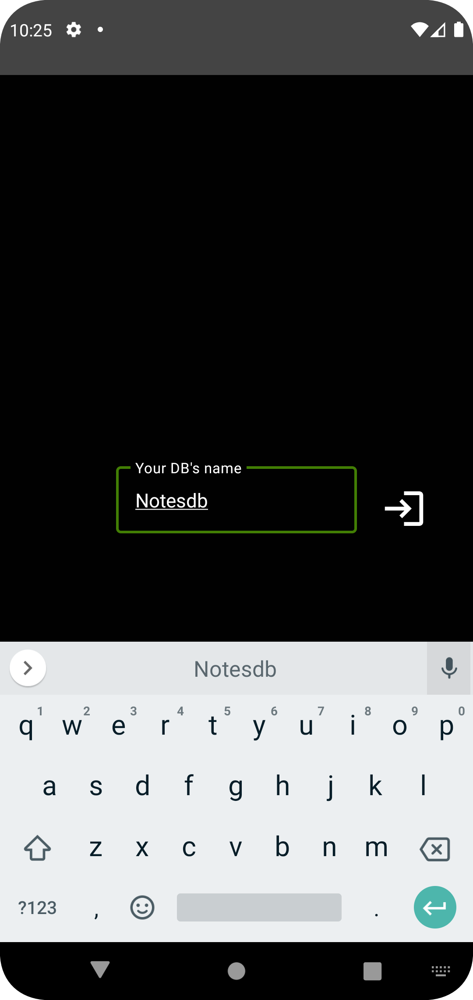

### Memo Activity

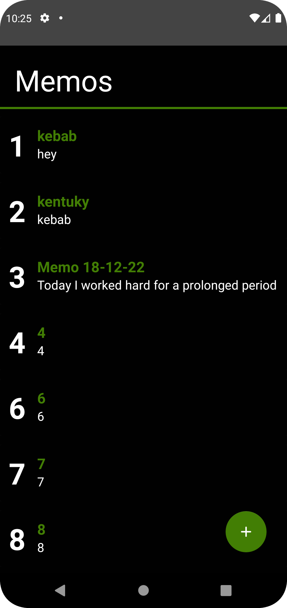

### Add Memo Activity

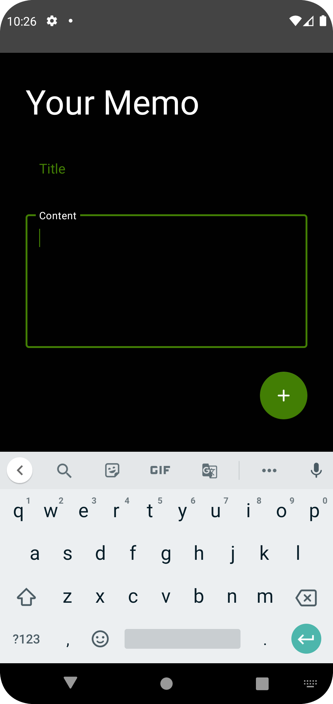

### Update Memo Activity

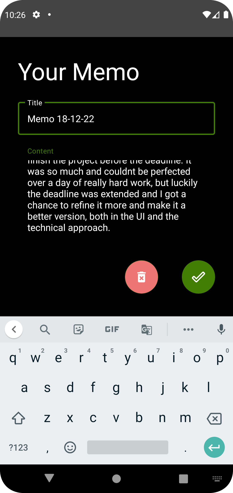

****
## Material Components
### Edit Text

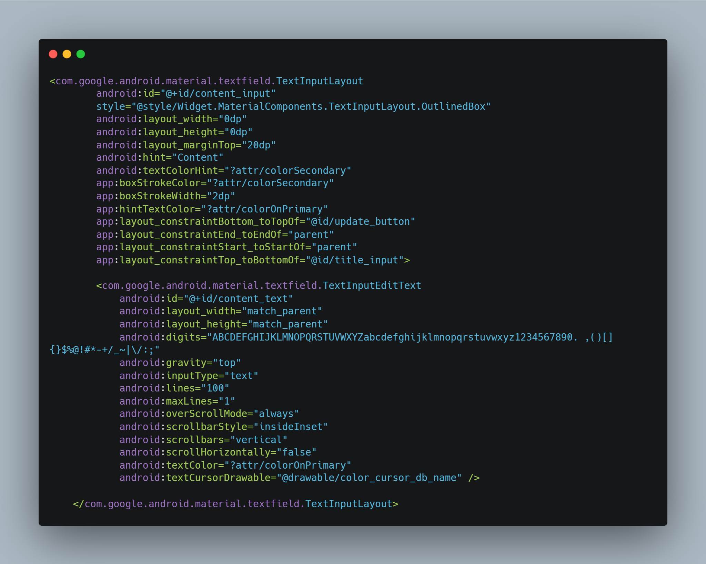

Here is an "edittext" sample code that we used throughout the app, which is its most useful component. As I said before, the whole app is based on constraint layout except for some small cases like the horizontal line in both the calculator activity and the memo activity and the item holder of the recyclerview, which is a cardview inside a linear layout. So the TextInputLayout, which is the mandatory container of TextInputEditText, is constrained both horizontally and vertically.

A constraint on the input of the edit text was imposed to guarantee the stable workflow of the app; such constraints differ from an activity's edit text to another's depending on the requirements and limits. Also, the TextInputEditText cursor was overridden through a custom style with a width of 1 dp and the secondary color as its main color.

### Drawables

We used a lot of drawables—15 to be exact. Each of them serves a different purpose in this app, but they are not all equally important. For reference, the most useful one of them is button_states.xml, which was used to reshape the button, add the ripple effect when the button is clicked, and also ensure that all the buttons of the calculator follow the same design, except the green equals button, which is the same too but with different colors, so it has its own drawable. Such a thing couldn't be done only using drawables, so styles and themes played a more major role in keeping the app design uniform and concise.

### Color Palettes

#### first palette

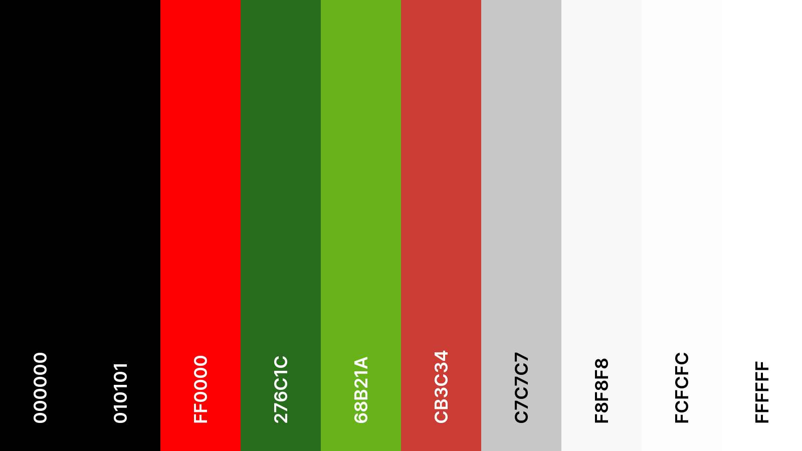

#### second palette

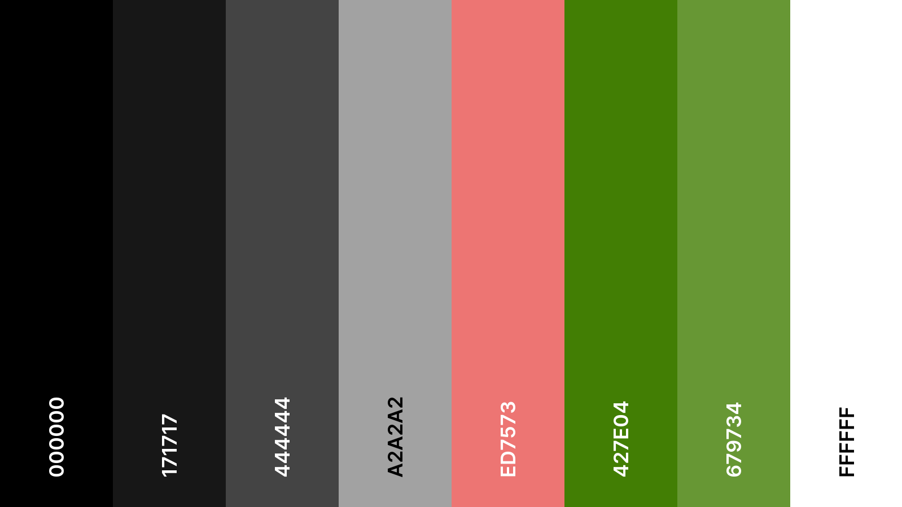

## Tests 

We hadn't done any instrumental tests, nor unit tests because we deemed them useless for such a small application; hence, everything was done manually.

****
## License

Apache License 2.0

****
## Credits 2022

* [Bahi Brahim](https://github.com/BAHIBrahim)
* [Nour eddine Alouaye](https://github.com/nour-eddine-alouay)